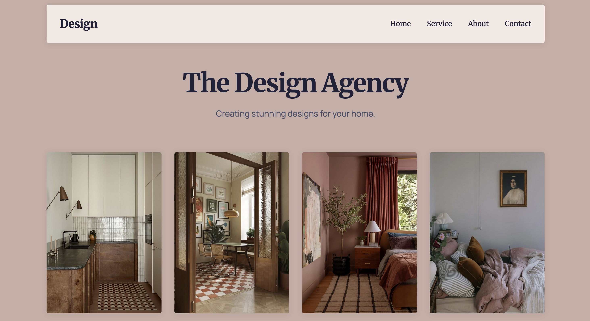

# Design Agency Landing Page

A responsive, modern landing page built with HTML5 and CSS3 (no frameworks) for a fictional design agency. It features a mobile-friendly navigation menu, responsive image gallery, smooth scrolling, and clean typography using Google Fonts.

## Features

- Fully responsive layout
- Mobile menu with overlay and toggle animation
- Image gallery with hover overlays and smooth scale effects
- Clean header with subtle shadow and blur
- Google Fonts: Merriweather (serif) & Manrope (sans-serif)
- CSS Grid for the gallery layout
- Uses modern CSS features:
  - `aspect-ratio`
  - `object-fit: cover`
  - CSS variables
  - Clamp-based typography
  - Smooth transitions

## Live Preview

[The Design Agency](https://design-agency-roan.vercel.app/)

## Screenshot 

